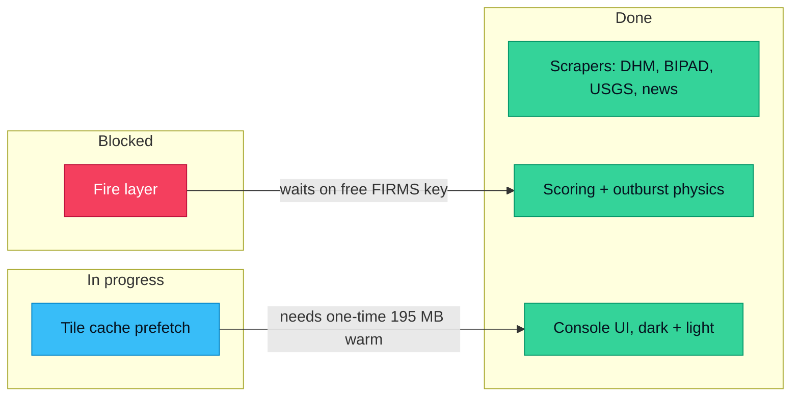
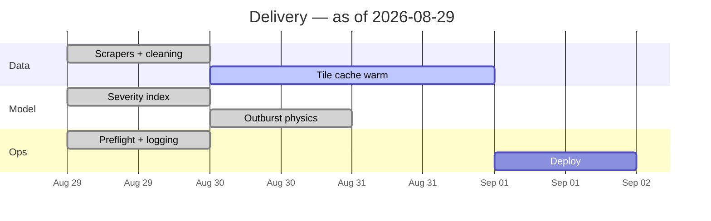

# Project tracker — progress as graphs

Turns a project's state into a diagram that answers one question at a glance.
Pick the chart that matches the question; do not render four charts when one
answers it.

## Choosing the form

| The question | Render |
|--------------|--------|
| What is done, in flight, blocked? | Status board (Mermaid flowchart, swimlanes by state) |
| Are we on track to finish? | Burndown (remaining work vs time, with the ideal line) |
| What happens when, and what overlaps? | Gantt |
| What is blocking what? | Dependency graph (Mermaid `graph LR`) |
| Which parts of the system are healthy? | Component health matrix |
| Where did the effort go? | Stacked bar by area |

If the answer needs prose, write prose. A diagram that restates a three-item
list is decoration.

## How to build one

1. **Read the real state first.** Prefer evidence over assumption: `git log`,
   open TODOs, the preflight output, `/api/health`, test results. A tracker
   built from guesses is worse than no tracker.
2. **Name the states explicitly** — Done / In progress / Blocked / Not started.
   Never more than five.
3. **Put the blocker on the edge**, not in a footnote. `A -->|waits on FIRMS key| B`
   is the whole point of a dependency graph.
4. **Date it.** Every tracker carries "as of <date>", because a stale tracker
   read as current is actively misleading.

## Output

Default to **Mermaid in a fenced block** — it renders in Markdown, in Artifacts,
and in most repo viewers, and it diffs as text.

Use an HTML artifact with Chart.js only when the data is genuinely quantitative
and continuous (burndown over many sprints, throughput over time). Static
categorical state does not need a chart library.

## Conventions

Status colours, used consistently across every graph in a project:

| State | Class | Colour |
|-------|-------|--------|
| Done | `done` | `#34D399` |
| In progress | `wip` | `#38BDF8` |
| Blocked | `blocked` | `#F43F5E` |
| Not started | `todo` | `#64748B` |

```
classDef done    fill:#34D399,stroke:#059669,color:#06121F
classDef wip     fill:#38BDF8,stroke:#0284C7,color:#06121F
classDef blocked fill:#F43F5E,stroke:#BE123C,color:#fff
classDef todo    fill:#64748B,stroke:#475569,color:#fff
```

Never encode state by colour alone — put the state in the node label or use a
distinct shape, so the graph survives greyscale printing and colour-vision
deficiency.

## Example — status board



## Example — Gantt



## Anti-patterns

- A Gantt with one bar per task and no dependencies — that is a list.
- Percentages with no denominator ("70% complete" of what?).
- Charts that hide the blocked items to make progress look better.
- Re-rendering an unchanged tracker every turn instead of saying "no change".
