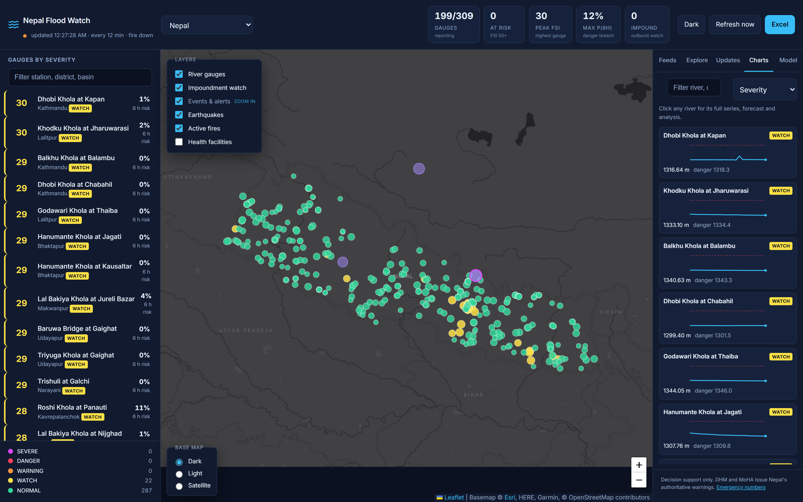
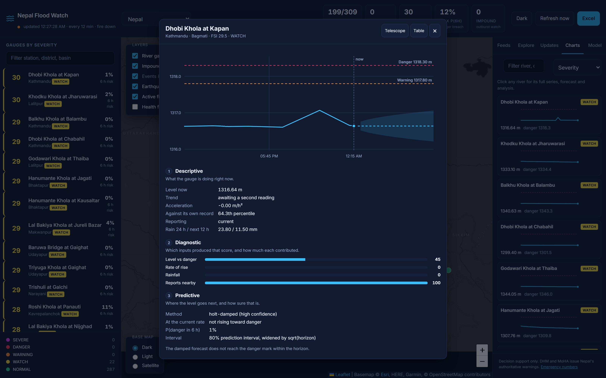
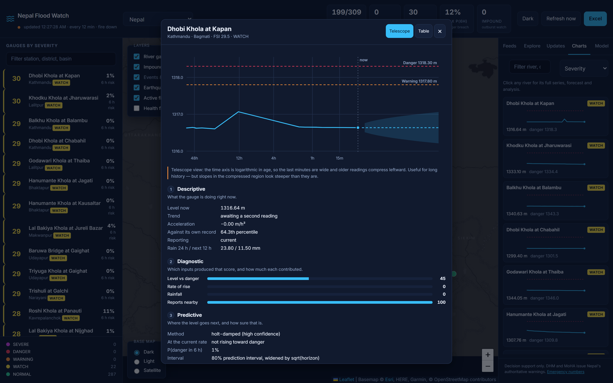

# Changelog

All notable changes to Nepal Flood Watch. Versions follow
[semantic versioning](https://semver.org/); dates are ISO.

Every entry that fixes a defect says **how the defect was found**, because on
this project that has turned out to be the more useful half of the record.

---

## [v1.5.0] — 2026-09-02

A ranked watch list for Nepal's known glacial lakes, a country-profile tab,
and a live check on every official link this console points at.

### Added

**GLOF watch.** A new **GLOF** tab and map layer ranking the six glacial
lakes ICIMOD/UNDP's 2026 regional inventory names Rank I for Nepal — Tsho
Rolpa, Imja Tsho, Thulagi, Lower Barun, Lumding Tsho, Hongu 2 — each
cross-checked against the *existing* live impoundment detector for any DHM
gauge in the same basin/headwater. This is deliberately a ranking of
already-identified danger, not a breach-probability prediction: unlike the
river forecast (only trusted after beating a naive baseline, see the model
bake-off), there is no labelled GLOF outcome history to validate a
probability model against, so none is offered. `GET /api/outburst/glof-watch`.

**Country profile.** A new **Profile** tab: 2021 census caste/ethnicity
shares from the National Statistics Office (Chhetri 16.45%, Brahmin-Hill
11.29%, Magar 6.9%, and more), linking to NSO's own interactive
province/district/municipality results explorer rather than mirroring it;
and DNPWC's protected-area system (12 national parks, 1 wildlife reserve, 1
hunting reserve, 6 conservation areas) with the most recent national survey
per flagship species — 429 tigers (2026), 752 rhinos (2021), ~230 elephants.
Every figure carries its publisher, source URL, and survey year.
`GET /api/reference/demographics`, `GET /api/reference/wildlife`.

**Official-source health check.** The Updates tab's linked government and
international sources now show a live reachable/unreachable dot, backed by a
45-minute background job — its own scheduler interval, never inside the
12-minute flood cycle. Confirmed directly that NDRRMA's "Daily Bulletin" and
DHM's notice pages are client-rendered SPAs with nothing structured to parse,
so this checks reachability honestly rather than faking a feed that isn't
there. `GET /api/official-sources`.

### Tests

Backend test suite grows by 13 cases: `TestGlofWatch` (ranking order, live
cross-check, the scope-disclaimer assertion that must never be quietly
deleted) and `TestReferenceData` (source citations present, DNPWC area
counts match the officially stated totals).

---

## [v1.4.0] — 2026-09-01

Live charts, a health layer that's actually visible, and a clear marker for
the gauge you clicked.

### Added

**Health facilities layer, on by default.** The layer already drew every
BIPAD-registered facility once zoomed to district level (zoom 10+); it just
required an opt-in click every session, so most viewers never saw it. Now
checked by default — still zoom-gated, so the country-level view stays a
clean severity map rather than a block of 16,295 markers.

**A selection ping that marks and recentres on the picked station.**
Clicking a gauge in the left panel now flies the map to it and drops a
band-coloured radar ping in place: a persistent halo keeps the exact spot
marked between pulses, two offset rings breathe outward continuously, and
every layer carries a black-and-white double outline so it reads against the
dark basemap, the light basemap, and satellite imagery alike. Falls back to
a static ring under `prefers-reduced-motion`.

### Fixed

**Charts froze on first load instead of following the live data.** The
Charts tab fetched its index once and kept it — thumbnails went stale after
the first cycle and stayed stale until a page reload. An open floating
window never updated at all: a new reading could land and the chart in front
of an operator would not know. Both now refresh on the same server-sent
event that refreshes everything else, and an arriving reading eases the
chart's clock forward over 900 ms (ease-out cubic) instead of teleporting,
so the history visibly slides left rather than jumping.

*Found while testing the fix itself:* the hidden-tab guard returned before
the second animation frame, so a settle started on a hidden tab froze
part-way through. A hidden tab now paints once at the final position and
stops rescheduling entirely — animating a slide nobody can see costs frames
and buys nothing.

---

## [v1.3.0] — 2026-09-01

Time-series charts for every river, and a correction to the strongest number
the system reports.

### Added

**Charts for all 309 gauges.** A Charts tab holding one small multiple per
river, severity-ranked and filterable, plus a floating window that opens on
click with the full series, the 12-hour forecast, its 80% prediction interval,
and DHM's published warning and danger marks as labelled reference lines.

**All four analytic layers in one place.** The floating window stacks
descriptive → diagnostic → predictive → prescriptive beneath the chart, in the
order an operator needs them.

**A telescope time axis.** Optional logarithmic-in-age x-axis: the last minutes
stay wide while older readings contract leftward without falling off, so days of
history and the last quarter-hour share one plot. Labelled by age (48h · 12h ·
4h · 1h · 15m) rather than clock time, and carrying an on-screen note that a log
axis makes slopes in the compressed region look steeper than they are. Opt-in,
never the default.

The drift animation falls out of the scale — both modes anchor on a moving
clock — so it needs no separate animation system. It pauses on hidden tabs and
stops under `prefers-reduced-motion`.

**New endpoints.** `GET /api/station/{id}/analysis` (chart-ready payload with
absolute timestamps and a pre-computed danger crossing) and
`GET /api/charts/index` (every gauge's recent series in one call).

**`docs/RESEARCH.md`** — techniques from the literature that touch decisions
already made here, each with what it would change and what it would cost.

**`tools/screenshots.py`** — the README images are now reproducible instead of
hand-captured.

### Fixed

**P(danger in 6 h) reported false certainty.** The probability was computed from
a single pair of readings with no allowance for how noisy that pair was. Kankai
at Mainachuli produced pairwise rise rates from −0.562 to +0.775 m/h *within one
hour*; the same function returned **0% at one end and 100% at the other**, and
the console displayed 100% for a river that did not flood. The logistic scale
now carries rate uncertainty measured from the gauge's own recent spread,
propagated over the full six hours. On that gauge the range collapses from
[0%, 100%] to [10%, 82%]; a clean, steadily climbing gauge still reaches >95%.

*Found by reading a screenshot taken for this release and not believing the
number.*

**Two contradictory numbers shown without explanation.** 35 gauges advertised a
countdown to danger while their forecast line stayed flat and the panel said
danger was never reached. These are different methods — straight-line
extrapolation versus the damped, shrunk forecast — and the linear one is exactly
what backtested 72% worse than persistence. Relabelled *"X h at this rate"*, with
the divergence explained in the predictive panel.

*Found by comparing the card badge against the chart beside it.*

**`/api/charts/index` ran an N+1 query.** One history query per gauge: 3.9 s for
309 gauges. A single windowed query returns the same data in 248 ms.

*Found by timing it.*

**The danger-crossing annotation never fired.** Every gauge in the database was
calm, so a dead branch and a working one were indistinguishable. Now pinned in
both directions by synthetic rising and falling gauges.

*Found by asking how many gauges exercised the branch, and getting zero.*

**Charts never rendered in a background tab.** The visibility pause ran before
the first paint, leaving the window on its loading text for anyone whose tab was
not focused when the data arrived.

*Found by a headless capture, which is always an unfocused tab.*

**A hidden tooltip rendered as an empty pill.** `display: grid` outranked the
user agent's `[hidden]` rule.

*Found in a screenshot.*

**Static assets sent no cache headers.** The server auto-deploys on push, so a
browser holding a heuristically cached `app.js` would run last week's frontend
against this week's API. Now `no-cache, must-revalidate`.

### Changed

- SQL in the bulk history query is fully static — no interpolated `IN` clause —
  so it needs no scanner suppression and no re-audit on reading.
- Chart grid drops to a 145px minimum, giving two columns on phones.

### Tests

128 passing, up from 103. New: `backend/tests/test_charts.py` (16 cases on the
chart payload) and `TestExceedanceConfidence` in `test_scoring.py` (9 cases
pinning the probability fix, including monotonicity — more noise may never
increase confidence).

---

## [v1.2.0] — 2026-08-30

Mobile. The console was unusable at 375px: six distinct layout failures
including a Continue button clipped off-screen. The gauge list and map overlays
now collapse on phones so the map is above the fold.

Also: a version marker, and private keys plus deployment notes moved into
`.gitignore` — `*.pem`, `*.key`, `id_rsa*` are ignored wherever they land.

---

## [v1.1.0] — 2026-08-30

Machine learning scaffolding and the analytics ladder.

`GradientBoosting`, `RandomForest` and `RidgeLinear` registered behind a
`Forecaster` protocol, with `/api/models/bakeoff` training and scoring every
model on the same live data. **None are enabled**: none beat persistence, and
shipping a model that loses to "assume no change" would be worse than shipping
nothing.

Live backtesting via `/api/forecast/skill`, the full cleaning → descriptive →
diagnostic → predictive → prescriptive pipeline, and CodeQL on push, PR and
weekly with `security-extended`.

---

## [v1.0.0] — 2026-08-30

First public release.

309 DHM river gauges on a 12-minute cycle. Flood Severity Index
(`0.50·level + 0.25·rise + 0.18·rain + 0.07·corroboration`) with five severity
bands. Damped Holt forecasting with signal-to-noise trend shrinkage — added
after straight-line extrapolation measured **72% worse than persistence** across
169 gauges.

Landslide- and moraine-dammed lake outburst physics (Froehlich 1995b, Costa &
Schuster 1988, Ermini & Casagli DBI), modelled on the Rasuwa 2025 event. The
length-of-day calculation for the claim that Chinese dams affect Earth's
rotation. Verified emergency numbers, 16,295 health facilities, official relief
channels. Leaflet map, SSE live push, six-sheet Excel export, FastAPI + SQLite,
no build step.

---

[v1.4.0]: https://github.com/Adwrells/nepal-flood-watch/releases/tag/v1.4.0
[v1.3.0]: https://github.com/Adwrells/nepal-flood-watch/releases/tag/v1.3.0
[v1.2.0]: https://github.com/Adwrells/nepal-flood-watch/releases/tag/v1.2.0
[v1.1.0]: https://github.com/Adwrells/nepal-flood-watch/releases/tag/v1.1.0
[v1.0.0]: https://github.com/Adwrells/nepal-flood-watch/releases/tag/v1.0.0
