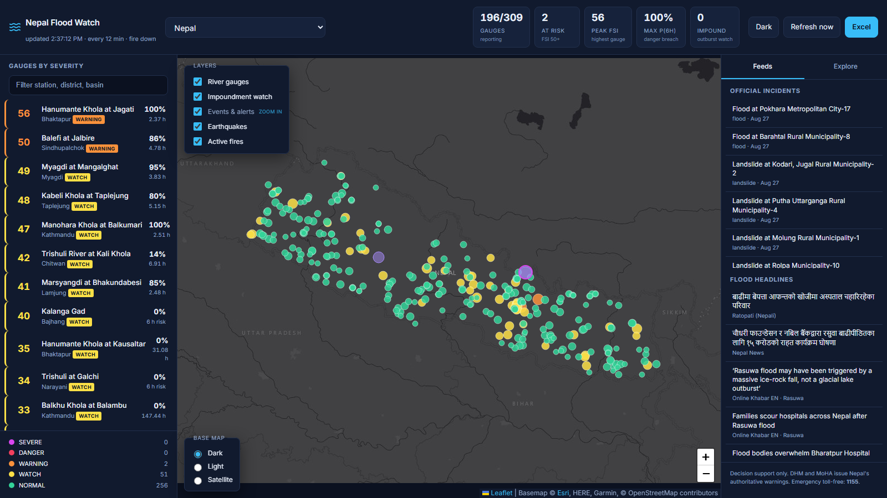
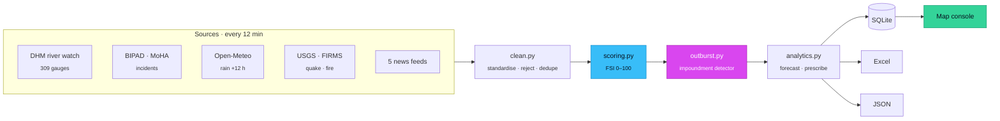
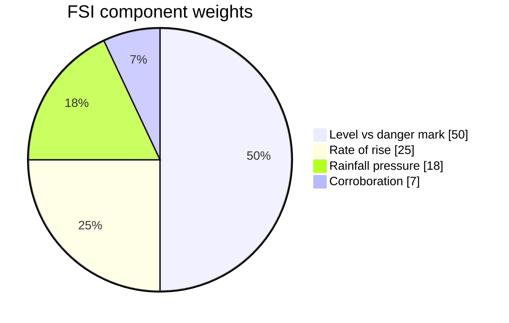
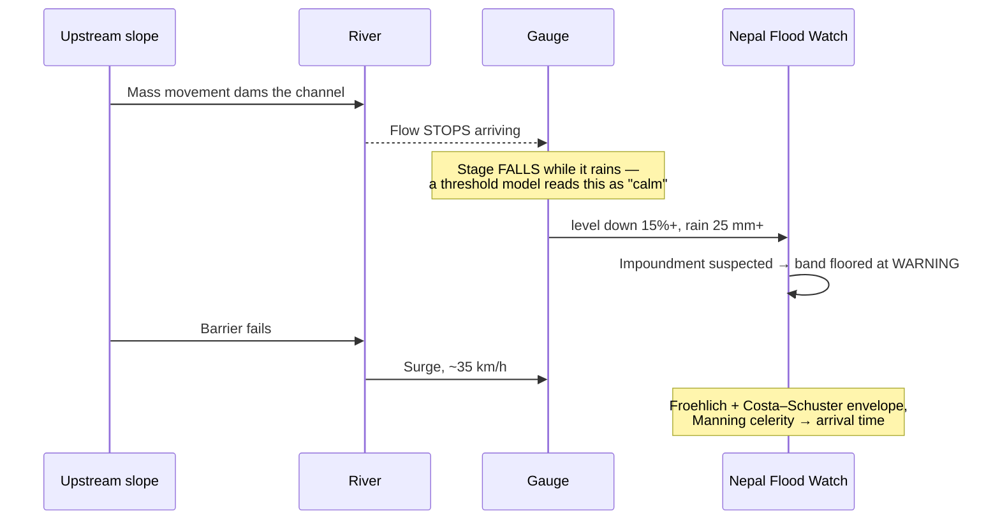
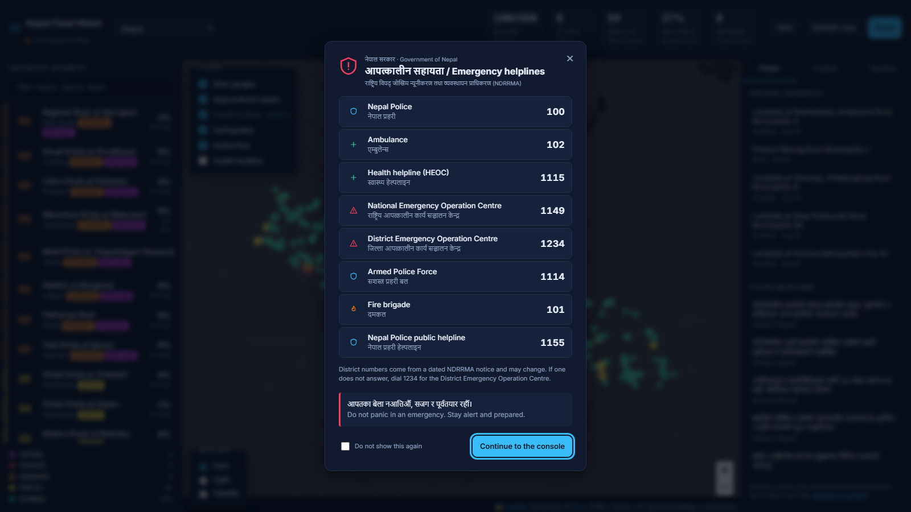
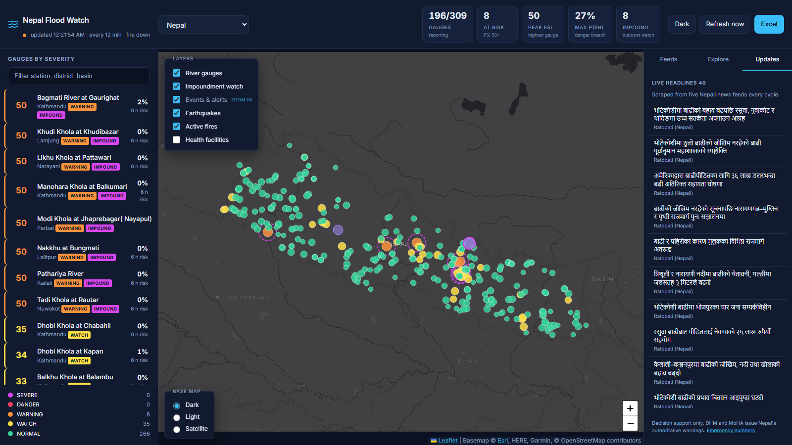
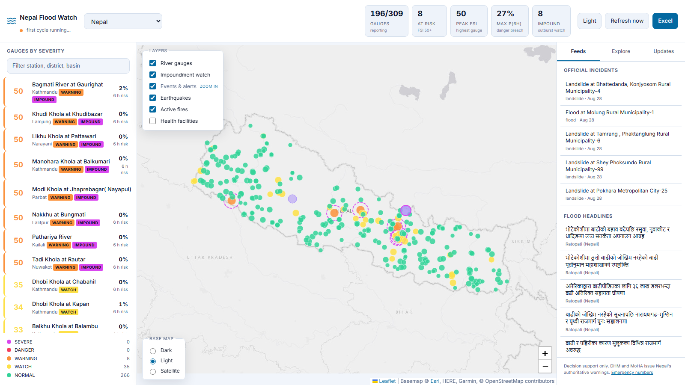
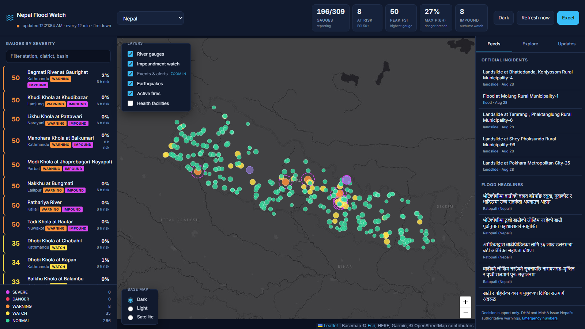
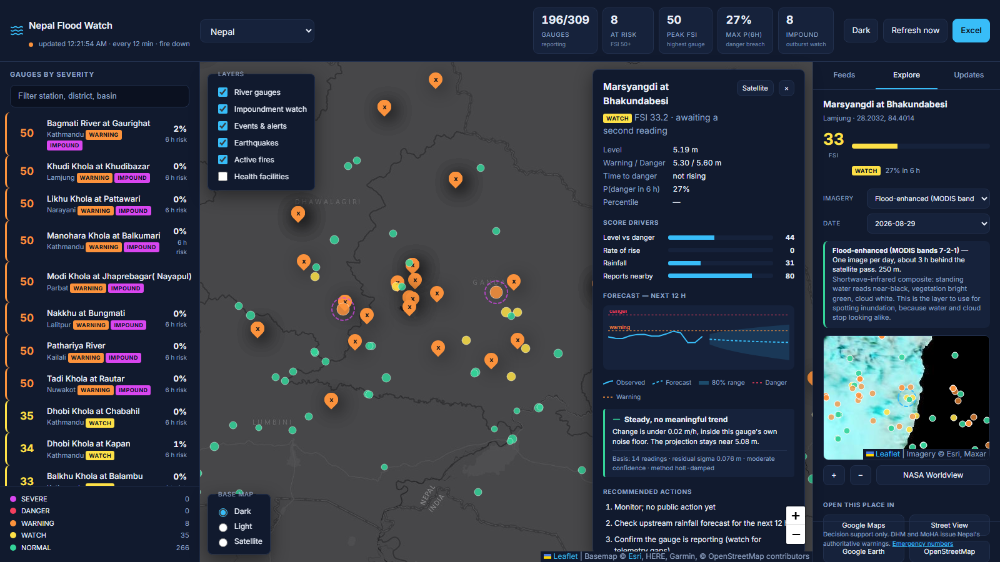

<h1 align="center">Nepal Flood Watch</h1>

<p align="center">
  <em>Live flood early-warning console for Nepal — 309 river gauges, scored every 12 minutes.</em>
</p>

<p align="center">
  
  
  
  
  
  
  
  
  
</p>



The system scrapes Nepal's official hydrological, disaster and news sources
every 12 minutes, scores every river gauge on a 0–100 severity index, forecasts
where each gauge is heading, and publishes the result as an interactive map, an
Excel workbook and a JSON snapshot.

> **This is decision support.** The Department of Hydrology and Meteorology (DHM)
> and the Ministry of Home Affairs (MoHA) issue Nepal's authoritative warnings.
> Emergency toll-free: **1155**.

### Severity bands

<table>
<tr>
<td align="center">🟣<br><b>SEVERE</b><br><sub>90–100</sub></td>
<td align="center">🔴<br><b>DANGER</b><br><sub>75–89</sub></td>
<td align="center">🟠<br><b>WARNING</b><br><sub>50–74</sub></td>
<td align="center">🟡<br><b>WATCH</b><br><sub>25–49</sub></td>
<td align="center">🟢<br><b>NORMAL</b><br><sub>0–24</sub></td>
</tr>
<tr>
<td align="center"><sub>At or past danger,<br>still rising</sub></td>
<td align="center"><sub>Danger mark<br>reached or imminent</sub></td>
<td align="center"><sub>Between warning<br>and danger</sub></td>
<td align="center"><sub>Elevated: rising or<br>heavy rain upstream</sub></td>
<td align="center"><sub>Within<br>normal range</sub></td>
</tr>
</table>

---

## What it does

The system monitors **309 DHM river gauges** across Nepal. For each one it
computes a Flood Severity Index from four weighted components, estimates the
probability that the gauge passes its danger mark within six hours, projects the
water level twelve hours ahead, and produces a ranked list of actions gated by
how much lead time remains.

Alongside the river model it tracks earthquakes (which trigger the landslides
that dam rivers), active fires (a burned catchment loses infiltration capacity),
official disaster incidents, and flood coverage from five news feeds including
the state-owned *Rising Nepal*.

It also carries a hazard model that a gauge-threshold system cannot express:
**landslide- and moraine-dammed lake outburst floods**, the class of event that
struck Rasuwa in July 2025.

Every gauge is plottable. A **Charts** tab holds one small multiple per river,
and clicking any of them opens a floating window with the full series, the
12-hour forecast and its 80% band, DHM's own warning and danger marks, and all
four analytic layers side by side.

Around that sit the things an operator needs *next*: verified emergency numbers,
the nearest of Nepal's 16,295 health facilities, official relief-fund channels,
flood safety guidance, and live headlines — pushed to the browser the moment a
cycle finishes rather than polled for.

### How a cycle works



---

## Quick start

```bash
git clone https://github.com/Adwrells/nepal-flood-watch
cd nepal-flood-watch
```

`launch.py` runs identically on Linux, macOS and Windows. It creates the
virtual environment and installs dependencies on first run, then re-executes
itself inside it, so nothing beyond the standard library is needed to start.

```bash
python launch.py
```

The console comes up at **http://127.0.0.1:8000**. The first cycle runs
immediately, so the map is populated within about thirty seconds.

One command does everything: creates the virtual environment, installs
dependencies, picks a free port if 8000 is taken, starts the server, and opens
your browser once it actually answers. The backend serves the frontend itself,
so there is no second process and no build step.

| Command | Does |
|---------|------|
| `python launch.py` | Set up, serve, and open a browser |
| `python launch.py serve --no-browser` | Serve without opening a tab |
| `python launch.py serve --strict-port` | Fail on a busy port instead of moving up |
| `python launch.py serve --host 0.0.0.0 --port 9000` | Serve on a chosen address |
| `python launch.py check` | Deployment preflight, 20 checks |
| `python launch.py check --offline` | Preflight without live source calls |
| `python launch.py cycle` | Run one collection cycle and exit |
| `python launch.py tiles` | Warm the offline map cache (~16,600 tiles, ~195 MB) |
| `python launch.py setup` | Create the venv and install dependencies only |

Requires Python 3.11+.

### Dependencies

Three files, split so the runtime stays small:

| File | Contains | When |
|---|---|---|
| `backend/requirements.txt` | Runtime — FastAPI, httpx, APScheduler, openpyxl, defusedxml | Always |
| `backend/requirements-ml.txt` | scikit-learn, for the learned forecasters | Only once a learned model beats persistence (~100 MB) |
| `backend/requirements-dev.txt` | pytest, coverage, ruff | Working on the project |

```bash
python launch.py setup --dev       # tests and linting
python launch.py setup --with-ml   # learned forecasters
```


Configuration is optional — every setting has a working default. Copy
`.env.example` to `.env` only to change the refresh cadence or enable the fire
layer.

---

## Data sources

Five of the six sources need no API key.

| Source | Provides | Key |
|--------|----------|-----|
| [DHM river watch](https://www.dhm.gov.np/hydrology/river-watch) | 309 gauges: stage, warning and danger marks, coordinates | none |
| [BIPAD Portal](https://bipadportal.gov.np/) (MoHA) | Official disaster incidents, filtered to water hazards | none |
| [Open-Meteo](https://open-meteo.com/) | Rainfall: 24 h observed + 12 h forecast per gauge | none |
| [USGS FDSN](https://earthquake.usgs.gov/fdsnws/event/1/) | Earthquakes in the Nepal bounding box | none |
| News RSS ×5 | Rising Nepal, Kathmandu Post, Online Khabar, Nepal News, Ratopati | none |
| [NASA FIRMS](https://firms.modaps.eosdis.nasa.gov/api/area/) | VIIRS active-fire detections | free |

Without a FIRMS key the fire layer is simply disabled; everything else runs.

**Facebook** is supported through the Graph API only, for Pages the operator
owns or administers. Scraping facebook.com HTML violates their Terms of Service
and is not implemented.

---

## The severity model

```
FSI = 0.50·level + 0.25·rise + 0.18·rain + 0.07·corroboration
```

| Component | What it measures | Full scale |
|-----------|------------------|-----------|
| Level | Proximity to DHM's published danger mark | at danger = 85–100 |
| Rise | Rate of climb, the lead indicator | 0.50 m/h |
| Rain | 24 h observed + 12 h forecast over the gauge | 200 mm |
| Corroboration | Official incidents and headlines nearby | incident within 25 km |

**Bands:** SEVERE ≥ 90 · DANGER ≥ 75 · WARNING ≥ 50 · WATCH ≥ 25 · NORMAL < 25



A slow river at 90% of its danger mark is calmer than a fast one at 60%, which
is why rate of rise carries a quarter of the weight.

Every gauge opens into a full breakdown — the four score drivers, a 12-hour
forecast with its 80% prediction band, and a verdict that cites the rate, the
sample size and the residual sigma it rests on. Opening a gauge also flies the
map to it and drops a band-coloured pulse marking the exact spot, so the
selected station is never lost in a dense cluster:


---

## Charts

Every river, plotted. The **Charts** tab is a grid of small multiples — one per
gauge, ranked by severity, each showing its recent trajectory against its own
danger mark. In a wall of flat lines, the one that is not flat is the finding.


Clicking any river opens a floating window with the full picture: observed
level, the 12-hour forecast as a dashed continuation, the 80% prediction
interval as a shaded cone, and DHM's published warning and danger marks as
labelled reference lines. Underneath sit the four analytic layers in the order
an operator needs them — what is happening, why the score says so, what happens
next, and what to do about it.


### Two time axes

Linear is the default and the honest one. **Telescope** maps history onto
`log(age)`: the last minutes stay wide while older readings contract toward the
left edge, so days of history and the last quarter-hour share one plot without
either being squeezed out. The axis relabels itself by age — 48h, 12h, 4h, 1h,
15m — because clock times on a log scale read as evenly spaced when they are not.


It is opt-in, labelled in the UI, and never the default, for one reason: a
logarithmic time axis **distorts slope**. The same rise drawn in the compressed
region looks steeper than it does next to "now". That is a fine trade when you
are scanning for the shape of a long record and a bad one when you are judging
a rate, so the console says so on screen rather than leaving it to be noticed.

Both modes anchor on a moving clock, which is why the chart drifts on its own:
the animation is a property of the scale, not a layer on top of it. It pauses
when the tab is hidden and stops entirely under `prefers-reduced-motion`.

Both the grid and an open floating window also refresh on the same live push
that updates the map — a completed cycle re-fetches the open gauge and eases
its chart forward to the new reading rather than jumping, so a chart in front
of an operator never goes stale until they close it.

### Two numbers that disagree, on purpose

A gauge card may say *"4.62 h at this rate"* while the forecast line stays flat.
Both are shown because they answer different questions:

| Number | Method | Read it as |
|--------|--------|-----------|
| `X h at this rate` | Straight-line extrapolation of the current rise | Worst case if the rate holds |
| The forecast line | Damped Holt, trend shrunk by signal-to-noise | The expectation |

Straight-line extrapolation backtested **72% worse than assuming no change at
all**, which is precisely why the forecast damps it. Showing only the countdown
would overstate the risk; showing only the forecast would hide a fast riser. The
predictive panel explains the divergence in place rather than leaving an
operator to discover it.

---

## Outburst floods

The July 2025 Rasuwa / Bhote Koshi disaster is the reason this module exists. A
mass movement in the Tibetan headwaters impounded the river, the lake filled
over hours, the barrier failed, and the surge reached Rasuwagadhi with almost no
warning.

A threshold model is structurally blind to that event, because the diagnostic
signal is **not a rising river**. It is a river that goes abnormally quiet while
rain is falling on its catchment, because water is being stored behind a
barrier.



The system detects that signature directly, applies published dam-break
relations (Froehlich 1995b; Costa & Schuster 1988) to estimate the peak
discharge envelope, and uses Manning-based wave celerity to give downstream
arrival times. Barrier stability is assessed with the Ermini & Casagli
Dimensionless Blockage Index, validated against Tangjiashan (Wenchuan 2008) on
every preflight run.

Transboundary basins get a lower alarm threshold, because the barrier may form
entirely outside Nepal's observation network. A suspected impoundment floors the
band at WARNING — otherwise the plain score would report a falling river as calm
at exactly the wrong moment.

Full derivations are in [docs/ARCHITECTURE.md](docs/ARCHITECTURE.md), and the
forecast's measured accuracy and error sources in
[docs/ANALYTICS.md](docs/ANALYTICS.md).

---

## Glacial lake watch

A **GLOF** tab and map layer for the question the outburst model above cannot
answer on its own: *which specific lakes are the known danger, and is anything
happening near them right now?*

Nepal's six lakes named as highest priority (Rank I) by ICIMOD and UNDP's 2026
glacial lake inventory — Tsho Rolpa, Imja Tsho, Thulagi, Lower Barun, Lumding
Tsho and Hongu 2 — are cross-checked every cycle against the same
falling-while-raining precursor the river model already uses, for any DHM
gauge in the same headwater or district.

> **This is a ranking of already-identified danger, not a breach prediction.**
> Unlike the river forecast, there is no labelled GLOF outcome history to
> backtest a probability model against, so none is offered. A lake either has
> a live gauge currently showing the impoundment signature nearby, or it does
> not — stated plainly, the same discipline the forecast bake-off applies
> everywhere else in this system.

Sources: [ICIMOD/UNDP's 2026 PDGL inventory](https://www.icimod.org/new-glacial-lake-inventory-report-released-47-potentially-dangerous-glacial-lakes-ranked/)
(47 lakes across Nepal, Tibet and India, ranked I–III) and
[DHM/UNDP's risk-reduction priority list](https://www.undp.org/nepal/press-releases/report-icimod-and-undp-identifies-potentially-dangerous-glacial-lakes-koshi-gandaki-and-karnali-river-basins).

---

## On dams and Earth's rotation

The system includes a worked answer to a claim that comes up often: that Chinese
dams and mountain excavation slow Earth's rotation and thereby cause floods in
Nepal.

Half of that is real physics, and the module computes it properly. Filling the
Three Gorges reservoir does lengthen the day, by about **0.12 microseconds**.

It has no bearing on flooding. That figure is roughly 8,000× smaller than the
ordinary seasonal swing in day length, and no term linking rotation rate to
river discharge exists in the governing equations.

The genuine transboundary risk is different and is modelled for real: barriers
can form in Tibetan headwaters that Nepal's gauge network cannot observe, and
cross-border real-time data sharing is limited. That observability gap is what
produced the Rasuwa surge. `GET /api/explain/earth-rotation` returns the full
calculation.

---

## Emergency response

### The numbers, verified

Every contact records its source and whether it was independently confirmed.
This corrected a real error: the console previously showed **1155** as *the*
emergency line. 1155 is the Nepal Police public helpline — the disaster hotline
is **1149** (NEOC) and the health line is **1115** (HEOC), confirmed against
`heoc.mohp.gov.np`.



The notice is **markup, not the poster image**. Numbers in a JPEG cannot be
tapped, copied, translated or read aloud by a screen reader — and on a phone
during a flood, tap-to-dial is the entire point. Rows are 46 px for one-handed
use. It appears once, and remembers being dismissed.

### Nearest health facilities

16,295 geocoded sites from BIPAD's resource register, refreshed **daily** rather
than per cycle — the source records date from 2022, so re-pulling 16k rows every
12 minutes would be waste and a discourtesy to a government server.

```bash
curl '/api/facilities/nearest?lat=28.28&lon=85.38&limit=3'
#   4.45 km  Timure Health Post Rasuwa
#   6.27 km  Dahalfedi Community Health Unit
#   8.69 km  Thuman SHP
```

Queries filter by bounding box in SQL before computing haversine; doing the
trigonometry on all 16,295 rows for every map click would be pointless work.

Every map popup also offers **Google Maps, Directions, OpenStreetMap** and a
copy-coordinates button.

---

## Updates, safety and relief



**Live headlines** scraped from five Nepali feeds, alongside links to NDRRMA,
DHM, Nepal Police, WHO, UN OCHA, IFRC, UNICEF, ReliefWeb, and the pages of
elected representatives.

Those pages are **linked, not scraped**. Reading a Facebook Page's posts
requires Graph API access to a Page you administer; these belong to public
figures and organisations we do not administer. A link is the honest option —
and it opens the real post, with its comments and video, which no scrape would
reproduce. The same applies to NDRRMA's Daily Bulletin and DHM's notice pages:
both are client-rendered pages with nothing structured to parse, so instead of
a fake feed, a background job HEAD-checks each linked source every 45 minutes
and shows a live reachable/unreachable dot next to it — a dead government link
in a disaster console is worse than a slow one.

**Flood safety guidance** is split into *do* and *do not*, because the failure
mode in floods is people acting wrongly with confidence rather than freezing.
The do-not list leads with walking and driving through water — consistently the
largest causes of flood deaths — and includes this system's own outburst
signature: *a channel that has gone unusually dry can mean an upstream blockage
is about to fail.*

### Donations: links only, deliberately

The relief section links to the Government of Nepal's official payment pages.
It **does not reproduce bank account numbers and does not generate QR codes.**

The Prime Minister's Office has publicly warned that individuals and groups are
circulating unofficial QR codes and personal account numbers to collect relief
money. A QR code this app draws itself would be indistinguishable, to whoever
scans it, from exactly that. A transposed digit also sends money somewhere
unrecoverable, and a hardcoded copy goes stale silently while a link does not.

Verified destinations: **pmdrf.nchl.com.np**, operated by Nepal Clearing House
Ltd for the government, and the Himalayan Bank gateway named in the PMO notice.
The PMO's own rule is shown prominently — *the recipient name must read "Prime
Minister Disaster Relief Fund"*.

---

## Country profile

A **Profile** tab for the national context a flood console otherwise assumes:
who lives where, and what land is protected.

**Caste and ethnicity** — the major groups from the 2021 census (Chhetri
16.45%, Brahmin-Hill 11.29%, Magar 6.9%, Tharu 6.2%, Tamang 5.62% and more),
sourced from the National Statistics Office. National totals only: NSO's own
[interactive results explorer](https://censusresults.nsonepal.gov.np/) goes
down to province, district and municipality, and is linked rather than
mirrored — 753 municipalities of drill-down data belongs in NSO's own tool,
not duplicated here and left to go stale.

**Wildlife and protected areas** — DNPWC's full protected-area system (12
national parks, 1 wildlife reserve, 1 hunting reserve, 6 conservation areas)
and the most recent national survey for each flagship species: **429 tigers**
(2026 census), **752 greater one-horned rhinos** (2021 count, the world's
second-largest concentration after Kaziranga), and an estimated **230 Asian
elephants**.

Every figure names its publisher, its source URL, and — for the species
counts — its survey year, because a population count from a multi-year census
reported as if it were current is its own kind of inaccuracy.

---

## Outputs

**Interactive console** — dark and light themes, seven toggleable map layers
(river gauges, impoundment watch, events and alerts, earthquakes, active
fires, health facilities, glacial lake watch), a severity-ranked gauge rail,
and a detail drawer showing the score breakdown, a forecast sparkline with its
prediction band, and the recommended actions.

Event pins are teardrops rather than discs so an event never reads as a gauge,
and headline pins placed at a district centroid are drawn hollow because their
location is inferred rather than surveyed.

<table>
<tr>
<td width="50%"></td>
<td width="50%"></td>
</tr>
<tr>
<td align="center"><sub><b>Dark</b> — the default; ops rooms are dark</sub></td>
<td align="center"><sub><b>Light</b> — same tokens, swapped</sub></td>
</tr>
</table>

**Explore tab** — click any gauge or event to inspect it from orbit, with the
model's own severity tags drawn over the imagery. Two kinds of imagery are
offered and the panel always states which you are looking at:

<table>
<tr>
<td width="50%"></td>
<td width="50%"></td>
</tr>
<tr>
<td align="center"><sub><b>Esri</b> — sub-metre detail, but a mosaic<br>months to years old</sub></td>
<td align="center"><sub><b>MODIS 7-2-1</b> — 250 m, but from yesterday.<br>Standing water reads near-black</sub></td>
</tr>
</table>

That distinction is stated on screen every time, because for *"is this village
under water"* a two-year-old mosaic read as current is a dangerous mistake.

Alongside the imagery, `/api/nearby` lists BIPAD incidents, gauges, quakes and
headlines within 30 km with distances — a MODIS pixel cannot see a washed-out
footbridge, and an incident report cannot show how far water has spread.

**Live, not polled.** Server-sent events push an update the moment a cycle
finishes. The console is watched for hours at a time, and a 60-second poll meant
a new DANGER reading could sit unseen for most of a minute. A 5-minute poll
remains as a fallback where SSE is blocked, and the header carries a live
indicator.

Any view is deep-linkable, so a shift handover can point at one gauge rather
than at "the dashboard":

```
/#station=186&tab=explore&imagery=flood
```

| Hash key | Does |
|---|---|
| `station` | Open this gauge's detail drawer |
| `tab` | `feeds`, `explore` or `updates` |
| `theme` | `dark` or `light` |
| `basemap` | `dark`, `light` or `esri` |
| `imagery` | `esri`, `truecolor`, `flood` or `viirs` |
| `ack=1` | Skip the launch notice |
| `nolive=1` | Disable SSE — an open stream never goes network-idle, which hangs headless capture |

**Excel workbook** — six sheets, rewritten atomically every cycle: Dashboard
(band counts and the top 25), Stations (the full scored table with conditional
formatting), Rainfall, Incidents, News, and Method.

**JSON snapshot** and a **REST API** at `/api/*`.

---

## API

| Endpoint | Returns |
|----------|---------|
| `GET /api/stations` | All gauges with current scores; filter by `band` or `min_fsi` |
| `GET /api/summary` | Band counts, KPIs, last-cycle health |
| `GET /api/station/{id}` | Full analytics ladder plus history for one gauge |
| `GET /api/station/{id}/analysis` | Chart-ready: observed series, forecast, marks, danger crossing |
| `GET /api/charts/index` | Every gauge's recent series in one call, for the small multiples |
| `GET /api/events` | Placeable markers: model alerts, incidents, geolocated news |
| `GET /api/hazards` | Earthquake and fire events |
| `GET /api/outburst/alerts` | Gauges showing the impoundment signature |
| `GET /api/outburst/scenario` | Breach model; accepts `volume_m3` and `head_m` |
| `GET /api/outburst/glof-watch` | Nepal's known priority glacial lakes, cross-checked against live gauges |
| `GET /api/explain/earth-rotation` | The length-of-day calculation |
| `GET /api/emergency` | Verified emergency contacts, national and district |
| `GET /api/facilities/nearest` | Closest health facilities to a point |
| `GET /api/nearby` | Incidents, gauges, quakes and headlines around a point |
| `GET /api/relief` | Official donation channels and the PMO safety rule |
| `GET /api/reference/demographics` | 2021 census caste/ethnicity summary (NSO) |
| `GET /api/reference/wildlife` | Protected areas and flagship species counts (DNPWC) |
| `GET /api/official-sources` | Linked official sources plus a live reachability check |
| `GET /api/basins` | Per-basin coherence — is a rise corroborated by neighbours? |
| `GET /api/models/bakeoff` | Train and score every forecaster on the same live data |
| `GET /api/analytics/pipeline` | Cleaning → descriptive → diagnostic → predictive → prescriptive |
| `GET /api/forecast/skill` | Live backtest of the forecast against persistence |
| `GET /api/errors` | Recent faults; `?summary=true` groups them |
| `GET /api/stream` | Server-sent events, one per completed cycle |
| `GET /api/health` | Per-source status and data-quality report |
| `POST /api/refresh` | Force a cycle now |
| `GET /api/export.xlsx` · `/api/export.json` | Current exports |

---

## Project layout

```
nepal-flood-watch/
├── backend/app/
│   ├── main.py          FastAPI routes, scheduler, static mount
│   ├── pipeline.py      the 12-minute cycle
│   ├── clean.py         standardisation; runs before anything else
│   ├── scoring.py       Flood Severity Index + breach probability
│   ├── analytics.py     forecast, time-to-danger, action playbook
│   ├── excel.py         six-sheet workbook, atomic write
│   ├── tiles.py         local OSM tile cache, clipped to Nepal
│   ├── regions.py       region registry — the extension point
│   ├── emergency.py     verified contacts, each with its source
│   ├── relief.py        official donation links (no account numbers, by design)
│   ├── reference_data.py  census demographics + DNPWC protected areas (static)
│   ├── official_sources.py  45-min reachability check on linked official sources
│   ├── logs.py          rotating file logs, UTF-8 pinned
│   ├── preflight.py     20 deployment checks
│   ├── spiders/         one file per source, Scrapy-shaped
│   └── hazards/         outburst physics, glof_watch, quake, fire, earth rotation
├── frontend/            index.html, app.js, charts.js, styles.css — no build step
├── deploy/              litestream.yml, entrypoint.sh
├── docs/                ARCHITECTURE.md, ANALYTICS.md, RESEARCH.md, images/
├── tools/               screenshots.py — regenerates the README images
└── launch.py            cross-platform launcher
```

The spiders follow Scrapy's `name` / `start_urls` / `parse` shape without the
dependency: Scrapy pulls in Twisted and a reactor that six polite requests every
twelve minutes do not need.

---

## Design decisions worth knowing

**Source isolation.** A dead news feed contributes nothing and the cycle
continues. Nepali news sites move their RSS paths often, and a flood-warning
system that goes dark because a newspaper changed its CMS is worse than useless.

**Never invent a value.** An unparseable reading becomes `None` and is excluded
from scoring, never defaulted to zero. A zero stage would read as "river is
empty", score as safe, and is the most dangerous possible failure mode here.

**Colour is never the only signal.** Every marker and row carries the numeric
index and the band name, the severity ramp is monotonic in lightness as well as
hue, and event pins differ from gauges in shape.

**Machine learning is wired in but gated.** Gradient boosting, random forest and
ridge are implemented behind a common interface, with scikit-learn as an
*optional* dependency (`backend/requirements-ml.txt`) so the base image stays at
244 MB. Every model is scored by the same hold-out backtest, and the rule is
absolute: **a model may only be enabled if it beats persistence.**

At the time of writing it does not. Ridge trained on 2,547 examples and scored
**−8.8%**; gradient boosting and random forest correctly refuse to train below
10,000 examples. That number is published live at `/api/models/bakeoff` and in
the Model tab, and it will change as history accumulates — which is the point of
building the harness rather than the model.

---

## Extending to other countries

`regions.py` holds the registry. Nepal is the default and the only enabled
region; Bhutan and Uttarakhand are declared and disabled.

Rainfall, earthquakes and fire detection are already global. Enabling a region
requires one thing: a national gauge adapter. Add a spider, list it in the
region's `sources`, set `enabled = True`.

---

## Deployment

Container image, plus AWS steps for ECR, Lightsail and ECS Fargate:
**[docs/DEPLOY-AWS.md](docs/DEPLOY-AWS.md)**.

Two constraints are non-negotiable and are explained there: the service must run
as **exactly one instance** (the scheduler lives in the web process, so a second
task scrapes every source twice), and it needs **persistent storage** (the
reading history behind every forecast and the impoundment baseline lives in
`flood.db`).

The database replicates continuously to S3 with **Litestream**, so a redeploy
or a lost volume does not cost the gauge history. That was verified rather than
assumed: the Docker volume was deleted outright and a fresh container restored
the full history from object storage.

The whole ECR to ECS path is rehearsable locally against
[Floci](https://floci.io) before touching real AWS.

---

## Licence

**Apache License 2.0** — see [LICENSE](LICENSE) and [NOTICE](NOTICE).

Apache rather than MIT for two reasons that matter to this project specifically:
it carries an **explicit patent grant**, and an **explicit limitation of
liability** — which is not boilerplate for software that outputs flood
predictions someone might act on. Permissive rather than copyleft because the
point is adoption by government agencies and responders, and a copyleft licence
would deter exactly that.

`NOTICE` records the third-party data sources and their terms, and states
plainly that this is decision support rather than an official warning service.

---

## Attribution

Map tiles © [OpenStreetMap](https://www.openstreetmap.org/copyright)
contributors, © [CARTO](https://carto.com/attributions). Hydrological data from
DHM, Government of Nepal. Incident data from the BIPAD Portal, MoHA. Weather
from Open-Meteo. Seismic data from USGS. Fire detections from NASA FIRMS.
