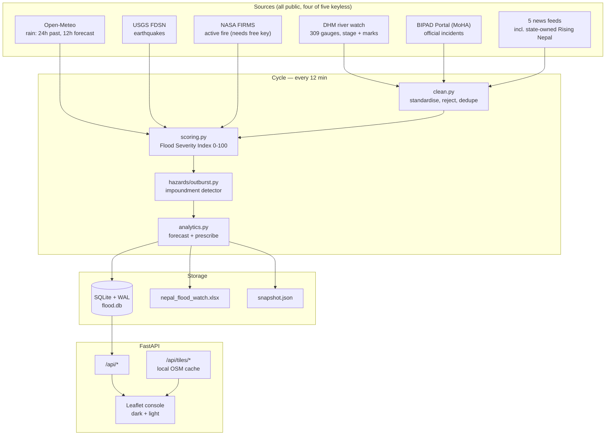

# Architecture

Nepal Flood Watch is a single-process FastAPI application that scrapes Nepal's
official hazard sources every 12 minutes, scores every river gauge, forecasts
where each one is heading, and serves the result as a map console, an Excel
workbook, and a JSON snapshot.

It is decision support. DHM and MoHA issue Nepal's authoritative warnings.

---

## 1. System shape



Everything runs in one process. There is no queue, no worker pool and no
external database, because the workload is ~6 HTTP requests and ~300 rows of
arithmetic every 12 minutes. Adding infrastructure here would add failure modes,
not capacity.

---

## 2. The cycle

`pipeline.run_cycle()` is the only thing the scheduler calls.

| Step | Module | Notes |
|------|--------|-------|
| 1. Scrape | `spiders/`, `hazards/` | Each source isolated; failures are recorded, not raised |
| 2. Clean | `clean.py` | Runs **before** anything spatial or numeric |
| 3. Rainfall | `spiders/rainfall.py` | Batched 100 coordinates per call, keyed off cleaned stations |
| 4. Score | `scoring.py` | FSI + 6-hour breach probability |
| 5. Outburst | `hazards/outburst.py` | Impoundment detector can override the band upward |
| 6. Analyse | `analytics.py` | Forecast, time-to-danger, action list |
| 7. Persist | `db.py` | SQLite, WAL so reads never block the write |
| 8. Export | `excel.py`, `pipeline` | Atomic temp-then-rename on both files |

**Isolation is the design rule.** A dead news feed contributes nothing to the
corroboration component and the cycle continues. This is not defensive
programming for its own sake: Nepali news sites move their RSS paths often, and
a flood-warning system that goes dark because a newspaper changed its CMS is
worse than useless.

---

## 3. The severity model

### Flood Severity Index (0–100)

```
FSI = 0.50·level + 0.25·rise + 0.18·rain + 0.07·corroboration
```

Each component is normalised to 0–100 before weighting, so the bands stay
comparable across basins with very different absolute river heights.

| Component | Full scale | Why this weight |
|-----------|-----------|-----------------|
| **Level vs danger mark** | at danger = 85–100 | Anchored on DHM's own published marks, not an invented threshold |
| **Rate of rise** | 0.50 m/h = 100 | The lead indicator. A slow river at 90% of danger is calmer than a fast one at 60% |
| **Rainfall pressure** | 200 mm = 100 | Past 24 h observed + next 12 h forecast, forecast weighted 1.2× because it has not reached the channel yet |
| **Corroboration** | incident within 25 km = 40 | Official reports and headlines confirming the gauge |

**Bands:** SEVERE ≥ 90 · DANGER ≥ 75 · WARNING ≥ 50 · WATCH ≥ 25 · NORMAL < 25

### Six-hour breach probability

```
projected = level + 6·rise_rate + 0.004·rain_forecast_mm
P = 1 / (1 + exp(−(projected − danger) / 0.35))
```

The logistic squash means the output degrades gracefully instead of snapping
between 0 and 1. The 0.35 m scale says "about a third of a metre of headroom is
where confidence crosses 50%".

---

## 4. Outburst floods — the hazard a gauge model cannot see

**The July 2025 Rasuwa / Bhote Koshi event is why this module exists.** A mass
movement in the Tibetan headwaters impounded the river, the lake filled over
hours, the barrier failed, and the surge reached Rasuwagadhi with almost no
warning.

A threshold model is *structurally blind* to this. The diagnostic signal is not
a rising river — it is a river that goes **abnormally quiet while it is raining
upstream**, because water is being stored behind a barrier.

### Precursor detection — turning small events into a warning

`detect_impoundment()` flags a gauge whose stage falls against the median of its
prior window while rain is landing on the catchment.

| | Ordinary basin | Transboundary / glacial headwater |
|---|---|---|
| Stage drop | ≥ 15% | ≥ 10% |
| Rain | ≥ 25 mm | ≥ 15 mm |

The lower bar for transboundary basins (Bhote Koshi, Trishuli, Arun, Sun Koshi,
Tama Koshi, Karnali, Marsyangdi, Budhi Gandaki, Seti) exists because the barrier
may form entirely outside Nepal's observation network — waiting for confirmation
means waiting for the flood.

**A suspected impoundment floors the band at WARNING.** Without that override
the plain score would report a falling river as calm at exactly the wrong moment.

### Breach physics

| Quantity | Relation | Source |
|----------|----------|--------|
| Peak discharge (embankment) | `Qp = 0.607·V^0.295·H^1.24` | Froehlich (1995b), 22 breaches |
| Peak discharge (landslide dam) | `PE = ρgVH`, `Qp = 0.763·PE^0.42` | Costa & Schuster (1988) |
| Wave celerity | `V = (1/n)·R^(2/3)·S^(1/2)`, `c = (5/3)V` | Manning + kinematic wave |
| Attenuation | `Q(x) = Qp·e^(−kx)`, k = 0.008/km | Confined bedrock gorge |
| Barrier stability | `DBI = log₁₀(A·H/V)` | Ermini & Casagli (2003) |

Both discharge relations are reported as an **envelope**, never a point
estimate — they disagree by up to 2× on natural barriers, and an evacuation
decision deserves the honest spread.

Defaults (S = 0.02, n = 0.05, R = 3 m) give c ≈ 9.8 m/s ≈ 35 km/h, consistent
with the observed Rasuwa propagation.

**Validation:** Tangjiashan (Wenchuan 2008; A = 3550 km², H = 82 m, V = 20.4×10⁶ m³)
returns DBI 4.15, "unstable — failure expected". That barrier did require an
emergency spillway. The preflight asserts this every run.

> **Units trap:** DBI takes catchment in km², height in m, and volume in
> **millions** of m³. `stability_index()` accepts plain m³ and converts
> internally, because every other volume in the codebase is m³ and a silent unit
> switch would be a genuinely dangerous bug.

---

## 5. Dams, Earth's rotation, and flooding

`hazards/earth_rotation.py` computes this properly rather than dismissing it,
because half the claim is real physics.

**The real part.** Filling a reservoir moves water from the globally distributed
ocean to one location, changing its distance from the spin axis and therefore
Earth's moment of inertia. Angular momentum is conserved, so day length changes:

```
ΔI = m·[ (R+h)²·cos²(lat_res) − R²·⟨cos²lat⟩_ocean ]
ΔLOD / LOD = ΔI / I
```

The **latitude** term dominates; the elevation lift is ~1000× smaller. Computing
only the lift term is the standard way to get this wrong by three orders of
magnitude, and the module reports both so the split is visible.

For Three Gorges this gives **+0.12 µs/day** (Chao at NASA GSFC publishes
~0.06 µs with a finer ocean-source model — same order).

**The part that does not hold.** Set that against what the planet does unaided:

| Effect | ΔLOD |
|--------|------|
| Seasonal atmospheric exchange | ±1000 µs |
| 2004 Sumatra M9.1 | 6.8 µs |
| 2011 Tohoku M9.1 | 1.8 µs |
| **Three Gorges reservoir** | **0.12 µs** |

The dam signal is ~8,000× below the ordinary seasonal wobble. And magnitude
aside there is **no mechanism**: length-of-day appears in no term of the
Saint-Venant equations. Rotation reaches hydrology only through the Coriolis
parameter `f = 2ω·sin(lat)`, and a fractional change in ω of ~10⁻¹² changes `f`
by the same fraction.

**What is actually worth worrying about upstream** is real and is modelled for
real in `outburst.py`: barriers can form in Tibetan headwaters that Nepal's
gauge network cannot see, and cross-border real-time hydrological data sharing
is limited. That observability gap produced the 2025 Rasuwa surge. It is an
*information* problem, not a rotational one.

---

## 6. Analytics ladder

| Layer | Question | Implementation |
|-------|----------|----------------|
| Descriptive | What is the river doing? | FSI, band, trend, percentile vs own history |
| Diagnostic | What is driving it? | Four-way component split |
| Predictive | Where will it be? | Damped Holt linear, 12 h, with 80% band |
| Prescriptive | What should be done? | Lead-time-gated action playbook |

**Holt with damping (α 0.45, β 0.25, φ 0.90).** Damping matters: an undamped
linear trend extrapolates a flood to infinity. The prediction band comes from
in-sample one-step residuals widened by √h, and it is honest — an erratic gauge
produces a wide band and says so.

Deliberately dependency-free. Fitting a neural net to a gauge with nine readings
would look more impressive and tell you less.

**Prescriptive means lead-time gating.** Each action carries the hours it needs;
an action requiring 6 hours is not advice when the river arrives in 40 minutes,
it is noise. A suspected impoundment prepends the outburst protocol, because the
standard ladder would otherwise say "no action" for a falling river.

---

## 7. Data cleaning

`clean.py` runs before anything else touches the data.

| Problem in the feed | Handling |
|---------------------|----------|
| Levels as `""`, `" "`, `"N/A"`, `"2.34 m"` | Parsed, or `None` |
| Lower-case unpunctuated station names | Title-cased, acronyms preserved |
| `Kavre` / `Kavrepalanchok` / `Kabhrepalanchok` | Canonical spelling |
| Mixed naive / offset / RFC-822 timestamps | ISO 8601 in Asia/Kathmandu (UTC+05:45) |
| Coordinates outside Nepal | Dropped |
| `danger ≤ warning` | Danger mark discarded |
| Impossible stage jumps (> 3 m/h) | Reading rejected, station retained |

**The rule is: standardise aggressively, never invent.** An unparseable value
becomes `None` and is excluded from scoring — never defaulted to zero. A zero
stage reads as "river is empty", scores as safe, and is the most dangerous
possible failure mode in this system.

---

## 8. Map tiles

Tiles are proxied and cached locally rather than loaded from OSM directly:

- an ops console that stops working when the internet does is not an ops console;
- hammering OSM's volunteer servers from an app that redraws every 12 minutes is
  what their tile usage policy asks you not to do.

Requests outside Nepal + a 1.5° context buffer are refused, so the cache cannot
grow into a world mirror. The buffer exists so Nepal does not render as an
island floating in blank space.

`POST /api/tiles/prefetch` warms z5–12: **~16,600 tiles, ~195 MB**. After that
the console runs offline.

---

## 9. Extending to other regions

`regions.py` is the single extension point. Nepal is the default and the only
enabled region; Bhutan and Uttarakhand are declared but disabled.

Rainfall (Open-Meteo), earthquakes (USGS) and fire (FIRMS) are already global.
**Enabling a region needs one thing: a national gauge adapter.** Add a spider,
list it in the region's `sources`, flip `enabled`.

---

## 10. Deliberate omissions

**Facebook is Graph-API-only.** Scraping facebook.com HTML violates their Terms
of Service, so the integration is token-gated for Pages you own or administer.
It is off by default.

**DHM's rainfall table is not scraped.** It sits behind a CSRF-guarded POST that
rejects non-browser sessions. Open-Meteo is used instead, and is strictly
better for this purpose because it supplies a *forecast* — which is what turns
the system from a nowcast into a prediction.

**No ML model.** With ~300 gauges reporting at irregular intervals and no
labelled flood outcomes, a learned model would be unvalidatable. Every number
this system produces traces to a published relation or a stated weight.

---

## 11. Operations

```bash
python -m app.preflight
```

20 checks: environment, model correctness (band monotonicity, probability
bounds, Tangjiashan DBI, the rotation calculation), data cleaning, and live
source reachability. Exits non-zero on any required failure. Run it after
changing a source or before deploying.

Logs rotate at 5 MB × 5 in `logs/` — `flood-watch.log` for the full narrative,
`errors.log` for WARNING and above. UTF-8 pinned, because Devanagari headlines
crash the Windows cp1252 default.
